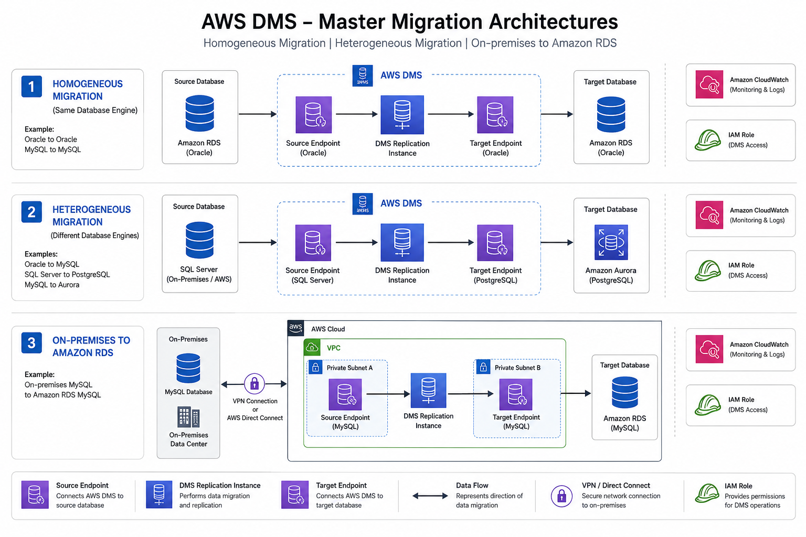

# AWS Database Migration Service (AWS DMS) — Enterprise Migration Lab

<p align="center">
  
</p>

<p align="center">
  <a href="https://aws.amazon.com/"></a>
  <a href="https://aws.amazon.com/dms/"></a>
  <a href="https://aws.amazon.com/rds/"></a>
  <a href="https://www.mysql.com/"></a>
  <a href="https://www.postgresql.org/"></a>
</p>

---

## 📌 Table of Contents

- [Executive Overview](#-executive-overview)
- [Architecture & Network Topology](#-architecture--network-topology)
- [Migration Scenarios Deep Dive](#-migration-scenarios-deep-dive)
  - [Scenario 1: Homogeneous Migration (MySQL → Amazon RDS MySQL)](#scenario-1-homogeneous-migration-mysql--amazon-rds-mysql)
  - [Scenario 2: Heterogeneous Migration (MySQL → Amazon RDS PostgreSQL)](#scenario-2-heterogeneous-migration-mysql--amazon-rds-postgresql)
  - [Scenario 3: On-Premises to Cloud (Local Server → Amazon RDS)](#scenario-3-on-premises-to-cloud-local-server--amazon-rds)
- [End-to-End Migration Lifecycle](#-end-to-end-migration-lifecycle)
- [Security, IAM & Networking Standards](#-security-iam--networking-standards)
- [Performance Tuning & Production Best Practices](#-performance-tuning--production-best-practices)
- [Monitoring, Observability & Cutover Strategy](#-monitoring-observability--cutover-strategy)
- [Repository Structure](#-repository-structure)
- [Tech Stack Reference](#-tech-stack-reference)
- [License](#-license)

---

## 🏢 Executive Overview

In enterprise modernization initiatives, database migration requires zero-data-loss tolerance, robust data integrity validation, and near-zero downtime cutover strategies. 

This repository delivers a comprehensive, hands-on blueprint demonstrating how **AWS Database Migration Service (AWS DMS)**, combined with **Amazon RDS**, solves complex database migration requirements across three mission-critical operational patterns:

1. **Homogeneous Migration:** Seamless like-to-like engine migration with minimal operational overhead.
2. **Heterogeneous Migration:** Cross-engine modernization requiring schema mapping, transformation rules, and data conversion.
3. **Hybrid On-Premises to Cloud Migration:** Secure data ingestion across boundary networks (VPN/Direct Connect) into fully managed cloud databases.

---

## 📐 Architecture & Network Topology

The following diagram represents the unified infrastructure topology supporting all three migration scenarios within AWS:

```text
                                       AWS CLOUD (REGION)
┌──────────────────────────────────────────────────────────────────────────────────────────────────┐
│  VPC (10.0.0.0/16)                                                                               │
│                                                                                                  │
│  ┌─────────────────────────────────────────────────┐   ┌──────────────────────────────────────┐  │
│  │ Private / DB Subnet Group                       │   │ Management & Replication Subnets     │  │
│  │                                                 │   │                                      │  │
│  │  ┌───────────────────┐                          │   │  ┌────────────────────────────────┐  │  │
│  │  │   Source DB       │                          │   │  │   AWS DMS Replication Instance │  │  │
│  │  │   (MySQL Engine)  │──── (Source Endpoint) ───┼───┼─►│   - dms.t3 / dms.c5 Instance   │  │  │
│  │  └───────────────────┘                          │   │  │   - Memory & CPU Optimization  │  │  │
│  │                                                 │   │  └───────────────┬────────────────┘  │  │
│  │                                                 │   │                  │ (Target Endpoint) │  │
│  │  ┌───────────────────┐                          │   │                  ▼                   │  │
│  │  │   Target DB (RDS) │◄─────────────────────────┼───┼──────────────────┘                   │  │
│  │  │  (MySQL / PgSQL)  │                          │   │                                      │  │
│  │  └───────────────────┘                          │   │  ┌────────────────────────────────┐  │  │
│  │                                                 │   │  │ Amazon CloudWatch Logs/Metrics │  │  │
│  │                                                 │   │  └────────────────────────────────┘  │  │
│  └─────────────────────────────────────────────────┘   └──────────────────────────────────────┘  │
└──────────────────────────────────────────▲───────────────────────────────────────────────────────┘
                                           │ IPsec VPN / Direct Connect / NAT Gateway
                                           │
                              ┌────────────┴────────────┐
                              │   ON-PREMISES DC / HOST │
                              │   Source SQL Database   │
                              └─────────────────────────┘
```

### Key Infrastructure Building Blocks
* **Dedicated DMS Replication Instance:** Standalone managed EC2 worker provisioned across Multi-AZ subnets for resilient continuous replication.
* **Granular Security Groups:** Point-to-point ingress rules restricted strictly to database listening ports (`3306` for MySQL, `5432` for PostgreSQL) between the DMS instance ENI and database hosts.
* **Encrypted Storage & Connections:** Enforced TLS/SSL for source/target endpoints and AWS KMS customer-managed keys for at-rest storage encryption.

---

## 🚀 Migration Scenarios Deep Dive

### Scenario 1: Homogeneous Migration (MySQL → Amazon RDS MySQL)
* **Objective:** Migrate a production MySQL database to Amazon RDS for MySQL with uninterrupted business operations.
* **Engine Compatibility:** Identical source and target dialect; native data types, triggers, routines, and constraints preserved.
* **Key Steps:**
  1. **Source Pre-requisites:** Enable binary logging on source (`log-bin`, `binlog_format=ROW`, `binlog_row_image=FULL`).
  2. **RDS Target Provisioning:** Deploy Amazon RDS MySQL Multi-AZ DB instance with customized parameter groups.
  3. **Task Strategy:** Configure AWS DMS Task for **Full Load + Ongoing Replication (CDC)** with data validation enabled.
  4. **Artifacts:** Inspect configuration outputs under [`homogeneous-migration/`](file:///d:/DevOps%20%2831-05-26%29/CLASS/Projects/aws-dms-full-migration-lab/homogeneous-migration).

---

### Scenario 2: Heterogeneous Migration (MySQL → Amazon RDS PostgreSQL)
* **Objective:** Modernize legacy database tier by migrating relational data from MySQL to open-source PostgreSQL on Amazon RDS.
* **Engine Compatibility:** Cross-engine conversion requiring data type adaptations, casing alignment, and schema refactoring.
* **Key Steps:**
  1. **Schema Extraction & Conversion:** Extract DDL and convert engine-specific constructs (e.g., `AUTO_INCREMENT` → `IDENTITY / SERIAL`, `DATETIME` → `TIMESTAMPTZ`, `TINYINT(1)` → `BOOLEAN`).
  2. **Target Pre-population:** Apply primary keys and core DDL to RDS PostgreSQL. Temporarily drop foreign keys and secondary indexes to maximize ingest throughput.
  3. **DMS Transformation Rules:** Add JSON table mapping rules for schema renaming, column filtering, and type casting.
  4. **Task Execution:** Execute Full Load, resolve data truncation edge-cases, and confirm CDC synchronization.
  5. **Artifacts:** Inspect configuration outputs under [`heterogeneous-migration/`](file:///d:/DevOps%20%2831-05-26%29/CLASS/Projects/aws-dms-full-migration-lab/heterogeneous-migration).

---

### Scenario 3: On-Premises to Cloud (Local Server → Amazon RDS)
* **Objective:** Ingest on-premises legacy operational database into AWS cloud infrastructure with zero operational disruption.
* **Engine Compatibility:** Remote host connectivity into private AWS VPC subnets.
* **Key Steps:**
  1. **Network Boundary Integration:** Configure secure network path (Static IP / Site-to-Site VPN / VPC Peering) permitting DMS replication agent traffic.
  2. **Baseline Initialization:** Import base schema and initial dataset baseline using standard SQL dumps (`onprem-backup.sql`).
  3. **Endpoint Validation:** Authenticate source endpoint over SSL against on-premises database daemon.
  4. **Validation & Cutover:** Validate source vs target record counts and trigger DNS switchover for application clients.
  5. **Artifacts:** Baseline backup scripts and evidence available under [`onprem-to-rds/`](file:///d:/DevOps%20%2831-05-26%29/CLASS/Projects/aws-dms-full-migration-lab/onprem-to-rds).

---

## 🔄 End-to-End Migration Lifecycle

```text
Phase 1: Assessment          Phase 2: Schema Prep         Phase 3: DMS Setup           Phase 4: Execution           Phase 5: Cutover
┌────────────────────┐      ┌────────────────────┐      ┌────────────────────┐      ┌────────────────────┐      ┌────────────────────┐
│ • Size Analysis    │      │ • Target Schema DDL│      │ • Rep. Subnet Group│      │ • Full Load Ingest │      │ • Stop Source Apps │
│ • Engine Feature   │ ───► │ • Drop Secondary   │ ───► │ • Replication Node │ ───► │ • CDC Catch-Up     │ ───► │ • Zero CDC Latency │
│   Compatibility    │      │   Indexes/FKs      │      │ • Test Endpoints   │      │ • Row Validation   │      │ • Redirect DNS/Apps│
│ • Enable Binlogs   │      │ • Provision RDS    │      │ • Mapping Rules    │      │ • CloudWatch Logs  │      │ • Post-check Valid │
└────────────────────┘      └────────────────────┘      └────────────────────┘      └────────────────────┘      └────────────────────┘
```

---

## 🛡️ Security, IAM & Networking Standards

- **Least Privilege Access:** IAM roles `dms-vpc-role` and `dms-cloudwatch-logs-role` grant strictly scoped privileges for ENI lifecycle management and CloudWatch stream generation.
- **Network Isolation:** DMS Replication Instance and target Amazon RDS instances are deployed exclusively within **Private Subnets** without public IP assignment.
- **Transit & Rest Encryption:** All inter-service communications enforce TLS/SSL. Storage volumes leverage AES-256 KMS encryption.
- **Dedicated Credentials:** Dedicated migration database users created with scoped replication privileges (`REPLICATION CLIENT`, `REPLICATION SLAVE`, `SELECT`).

---

## ⚡ Performance Tuning & Production Best Practices

| Technique | Phase | Impact / Rationale |
| :--- | :--- | :--- |
| **Secondary Index Deferral** | Full Load | Dropping target indexes prior to Full Load eliminates index maintenance overhead, improving write throughput by up to 300%. |
| **Limited LOB Mode** | Full Load & CDC | Setting maximum inline LOB chunk size (e.g., 32 KB) prevents multi-roundtrip LOB fetching, dramatically reducing memory pressure. |
| **Parallel Load Settings** | Full Load | Allocating 4–8 parallel threads (`max_parallel_load`) per large table maximizes network and I/O utilization. |
| **Commit Rate Batching** | CDC | Tuning `CommitRate` buffer reduces commit frequency on the target RDS instance during peak change activity. |
| **Storage Sizing** | Infrastructure | Sizing DMS storage buffers with high IOPS (GP3 / io2) prevents task disk exhaustion during high-volume CDC bursts. |

---

## 📊 Monitoring, Observability & Cutover Strategy

### Key CloudWatch Metrics Monitored
* **`CDCLatencySource`:** Latency between source database commit and DMS replication capture.
* **`CDCLatencyTarget`:** Latency between DMS capture and target RDS application commit.
* **`CPUUtilization` & `FreeableMemory`:** Replication instance compute headroom.
* **`ValidationPendingRecords` & `ValidationFailedRecords`:** Real-time data integrity validation counters.

### Zero-Downtime Cutover Checklist
1. Verify `CDCLatencyTarget` is stabilized at **0 seconds**.
2. Place source application in read-only / maintenance mode.
3. Confirm source transaction logs have fully drained through DMS (`CDC Incoming Changes = 0`).
4. Re-enable foreign keys, triggers, and secondary indexes on the target RDS database.
5. Update application configuration endpoints / Route 53 private hosted zone DNS records to point to RDS.
6. Run data reconciliation queries; resume full production traffic on RDS.

---

## 📂 Repository Structure

```text
aws-dms-full-migration-lab/
├── README.md                          # Comprehensive project documentation
├── LICENSE                            # MIT License
├── architecture-diagram/
│   └── aws-dms-all-cases.png          # High-resolution architectural blueprint
├── homogeneous-migration/             # MySQL to MySQL RDS replication artifacts
│   ├── dns-instance.png               # Replication instance provisioning
│   ├── dns-task.png                   # Task configuration & table mappings
│   ├── rds-databases.png              # Target RDS cluster topology
│   └── output.png                     # Task execution & validation results
├── heterogeneous-migration/           # MySQL to PostgreSQL RDS modernization
│   ├── dms-project.png                # Migration project definition
│   ├── dms-task.png                   # Heterogeneous transformation rules
│   ├── dms-task-complete.png          # Successful completion metrics
│   └── rds-databases.png              # Dual-engine RDS configurations
└── onprem-to-rds/                     # Hybrid on-prem to AWS RDS scenario
    ├── onprem-backup.sql              # Source schema definition & sample data
    ├── Screenshot 2026-08-20 143317.png
    ├── Screenshot 2026-08-20 143413.png
    └── Screenshot 2026-08-20 143458.png
```

---

## ⚙️ Tech Stack Reference

| Layer | Component / Tool | Details |
| :--- | :--- | :--- |
| **Cloud Provider** | AWS (Amazon Web Services) | Managed cloud infrastructure |
| **Replication Engine** | AWS DMS (Database Migration Service) | Full Load & Change Data Capture (CDC) |
| **Managed Databases** | Amazon RDS | Managed MySQL & PostgreSQL DB instances |
| **On-Premise / Source** | MySQL Server | Source relational database |
| **Security & Governance** | AWS IAM & AWS KMS | Role-based policies & cryptographic keys |
| **Observability** | Amazon CloudWatch | Task telemetry, latency alarms & event logs |
| **Networking** | Amazon VPC, Subnets, Route Tables, SGs | Isolated multi-tier network architecture |

---

## 📄 License

This repository is licensed under the [MIT License](LICENSE).
